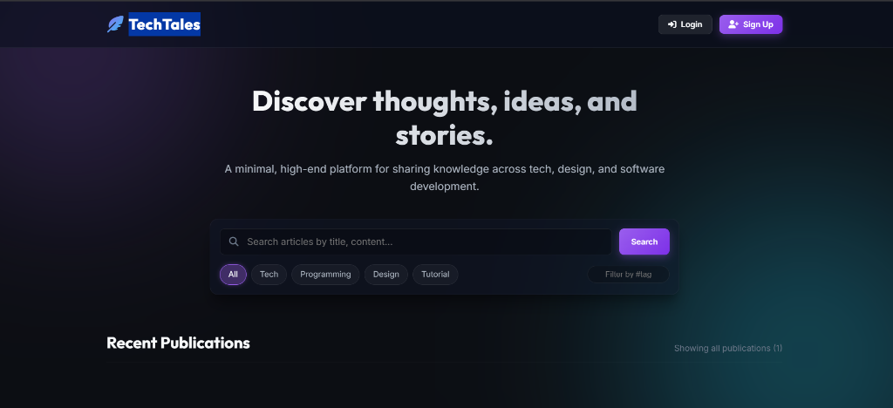
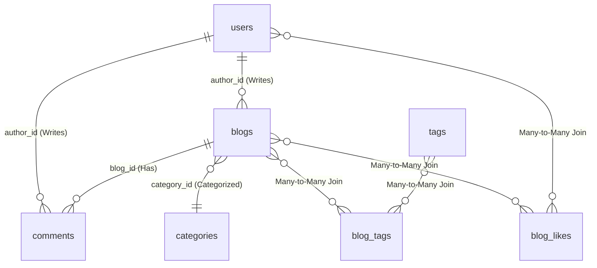

# 🖋️ TechTales | Premium Blogging Platform (API + Frontend)

[](https://www.oracle.com/java/)
[](https://spring.io/projects/spring-boot)
[](https://www.mysql.com/)
[](https://spring.io/projects/spring-security)
[](https://jwt.io/)
[](https://developer.mozilla.org/en-US/docs/Web/HTML)

TechTales is a **full-stack, production-grade blogging platform** built to demonstrate software engineering best practices. It features a robust, layered Java Spring Boot REST API, a highly normalized MySQL relational database design, secure stateless JWT authentication, and a stunning, responsive, glassmorphic Single Page Application (SPA) frontend.

---

## 🎨 Visual Preview & Live Demo



> 🔗 **Live Demo Link**: [https://techtales-6eij.onrender.com](https://techtales-6eij.onrender.com)

---

## 🚀 Key Technical Features

### 1. Robust Relational Database Design
* Normalized schema mapping Users, Blogs, Comments, Categories, and Tags.
* Bidirectional JPA mapping with `@OneToMany`, `@ManyToOne`, and `@ManyToMany` relations.
* Automated dynamic normalization: Category and Tag records are automatically resolved or created in their respective tables on-the-fly upon publication, requiring zero manual pre-seeding.

### 2. Stateless JWT Authentication & Security
* Spring Security 6 filter chains configuring open public read operations (browsing, searching, reading comments) and securing write actions.
* Stateless JSON Web Token (JWT) interceptor filter validating Bearer authorization headers.
* Industry-standard **BCrypt cryptographic password hashing** for safe database storage.

### 3. Advanced JPA/JPQL Query Optimization
* **Index-Optimized Case-Insensitive Searches**: Leverages MySQL's native case-insensitive collations for fast string matching without calling performance-heavy `LOWER()` functions on columns.
* **JPA Distinct Query Filters**: Solves SQL row duplication issues during many-to-many tag joins, ensuring clean paginated lists.
* **Database Aggregation Querying**: Calculates total likes received across an author's entire blog catalog inside the SQL engine in a single query, preventing N+1 database retrieval errors.

### 4. Stunning Glassmorphic SPA Frontend
* Beautiful, modern neon-dark HSL color palette featuring glassmorphism surfaces (`backdrop-filter`) and ambient glow lightings.
* **Split-Screen Live Editor**: Custom dual-binding listeners sync title, summaries, tags, and contents into a live reader preview panel in real-time as you write.
* **Micro-animations**: Hearts beating on like toggles, cards sliding on hover, page transitions, and slide-in notifications.
* **Self-Contained Packaging**: The entire SPA is bundled in Spring Boot's static resource container. Running the backend automatically serves the frontend at `http://localhost:8080/`.

---

## 🗄️ Database Entity-Relationship (ER) Model



---

## 🛠️ API Documentation (REST Endpoints)

| Method | Endpoint | Description | Security | Payload Summary |
| :--- | :--- | :--- | :--- | :--- |
| **POST** | `/api/auth/register` | Create a new user profile | Public | `{ username, email, password }` |
| **POST** | `/api/auth/login` | Authenticate credentials & get JWT | Public | `{ username, password }` |
| **GET** | `/api/blogs` | Get paginated blogs with search/filters | Public | Query params: `keyword`, `category`, `tag`, `page`, `size` |
| **GET** | `/api/blogs/{id}` | Read full article content | Public | Path: `id` |
| **GET** | `/api/blogs/author/{id}`| Fetch blogs written by specific author | Public | Path: `authorId` |
| **POST** | `/api/blogs` | Publish a new article | Logged In | `{ title, summary, content, categoryName, tags }` |
| **PUT** | `/api/blogs/{id}` | Edit an existing article | Logged In (Owner) | `{ title, summary, content, categoryName, tags }` |
| **DELETE** | `/api/blogs/{id}` | Permanently delete an article | Logged In (Owner) | Path: `id` |
| **POST** | `/api/blogs/{id}/like` | Toggle article like status | Logged In | Path: `id` (Returns updated counts) |
| **GET** | `/api/blogs/{id}/comments`| Fetch comments for an article | Public | Path: `blogId` |
| **POST** | `/api/blogs/{id}/comments`| Post a new comment | Logged In | `{ content }` |
| **DELETE** | `/api/comments/{id}` | Delete a comment | Logged In (Owner/Host)| Path: `commentId` |
| **GET** | `/api/users/profile/{username}`| Fetch public stats for user dashboard | Public | Path: `username` |

---

## ⚙️ Quick Start Installation & Execution

### Prerequisites
* **Java Development Kit (JDK) 21** or higher.
* **Apache Maven 3.x** command-line tool.
* **MySQL Server** running locally on port `3306`.

### Setup Steps
1. **Initialize the Database**:
   Create a new schema inside your MySQL Server:
   ```sql
   CREATE DATABASE blog_db;
   ```
2. **Update Database Credentials**:
   Open `src/main/resources/application.properties` and replace the database password with your local MySQL password:
   ```properties
   spring.datasource.password=YOUR_MYSQL_PASSWORD
   ```
3. **Compile & Run the Application**:
   Open a terminal in the project root directory and execute:
   ```bash
   mvn clean spring-boot:run
   ```
4. **Access the Platform**:
   Open your browser and navigate to:
   👉 **[http://localhost:8080/](http://localhost:8080/)**

---

## 💎 Software Engineering Interview Cheat Sheet

When showcasing this project during technical interviews, highlight these three architectural details to stand out:

1. **Relational Spam Moderation Rules**:
   In `CommentService.java`, explain that you designed comment deletion to be double-authorized: either the *writer of the comment* can delete it, or the *owner of the blog post* can delete it. This showcases strong product-focused thinking, representing how actual content moderation works on major blogging platforms.
2. **Aggregated Database Calculations**:
   Explain how you avoided costly in-memory loops and `N+1` database select queries by writing a custom JPQL query inside `BlogRepository.java` to sum all likes received across an author's entire blog catalog directly inside the SQL database engine in a single aggregate query.
3. **Stateless JWT Security Filters**:
   Explain how the application maintains state-free secure sessions. By using a custom `OncePerRequestFilter` (`JwtFilter.java`), the application dynamically extracts Bearer tokens, validates signatures, and loads user context dynamically on every secure REST request without holding memory-heavy sessions on the server.
